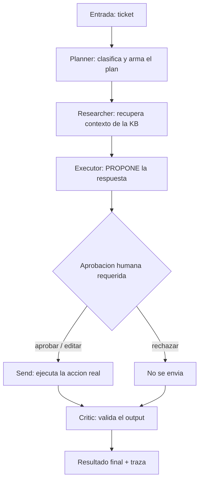

<p align="center">
<a href="https://www.linkedin.com/in/soriamaximilianorodrigo/" target="_blank" rel="noopener noreferrer">
</a>
</p>

<p align="center">
  <a href="#"></a>
  <a href="#"></a>
  <a href="#"></a>
  <a href="#"></a>
</p>

<p align="center">
  <a href="https://github.com/DietrichGebert/ponytail"></a>
  
  
</p>

<p align="center">
  
</p>

<!-- dynamic-badges -->
<p align="center">
  <a href="https://github.com/MaximilianoRodrigoSoria/multi-agent-orchestration/actions"></a>
  <a href="LICENSE"></a>
  
  
  <a href="https://maximilianorodrigosoria.github.io/multi-agent-orchestration/"></a>
  
</p>

<hr/>

<h1 align="center">multi-agent-orchestration</h1>

<p align="center">
Sistema <b>multi-agente</b> con orquestación y un paso de <b>human-in-the-loop</b>:
antes de ejecutar una acción crítica, el flujo se detiene y espera aprobación humana.
</p>

## Objetivo

Demostrar diseño de sistemas agénticos serios, no un demo de "un agente que llama tools". El foco está en tres cosas que separan un juguete de un sistema productivo:

1. **Orquestación con roles claros** — varios agentes especializados (planner, investigador, ejecutor, crítico) coordinados por un grafo de estados, no un loop opaco.
2. **Human-in-the-loop** — las acciones con efectos secundarios reales pasan por un gate de aprobación; el estado se persiste y el flujo puede reanudarse.
3. **Caso de negocio concreto** — aplicado a **triage de tickets de soporte** (clasificar, priorizar, proponer respuesta, y solo enviar tras aprobación) o, como alternativa, **investigación web automatizada** (planificar, buscar, sintetizar, y solo publicar tras aprobación).

## Stack tecnológico

- **Lenguaje:** Python 3.11+
- **Framework de orquestación:** LangGraph (recomendado por su soporte nativo de `interrupt`/checkpointing para HITL) — alternativas: CrewAI, AutoGen
- **LLM:** OpenAI / Anthropic (con function/tool calling)
- **Persistencia de estado:** checkpointer de LangGraph sobre SQLite/Postgres (para pausar y reanudar en el gate humano)
- **Herramientas de los agentes:** consumir el `mcp-server-demo` de este portfolio y/o el RAG de `rag-pipeline-eval`; búsqueda web vía Tavily/SerpAPI para el caso de investigación
- **Interfaz de aprobación:** CLI interactiva para empezar; opción de UI mínima con Streamlit o FastAPI + un endpoint `/approve`
- **Testing / calidad:** pytest, ruff, black

## Estructura de carpetas

```
multi-agent-orchestration/
├── README.md
├── AGENTS.md                        # Ruleset ponytail (código mínimo)
├── pyproject.toml
├── .env.example
├── src/
│   └── multi_agent_orchestration/   # Paquete importable (src layout)
│       ├── config.py               # Settings (pydantic-settings)
│       ├── state.py                # TicketState: estado compartido del grafo
│       ├── llm.py                  # LLM conmutable (Ollama/Claude) + inyección
│       ├── graph.py                # Grafo LangGraph + interrupt_before (HITL)
│       ├── agents/
│       │   ├── planner.py          # Clasifica el ticket y arma el plan
│       │   ├── researcher.py       # Recupera contexto (KB; extensible a RAG/MCP)
│       │   ├── executor.py         # Redacta la respuesta PROPUESTA (no envía)
│       │   └── critic.py           # Valida el output final
│       ├── tools/
│       │   └── ticket_tools.py     # Acción crítica: enviar la respuesta
│       ├── hitl/
│       │   └── approval.py         # Lógica del gate (aplica la decisión humana)
│       └── app/
│           └── cli.py              # CLI interactiva (punto de entrada)
├── examples/
│   └── sample_tickets.jsonl        # Tickets de ejemplo
├── docs/
│   └── flow.md                     # Diagrama del flujo (Mermaid) y roles
└── tests/                          # Offline, con LLM mockeado
    ├── test_graph.py               # Grafo + gate HITL (LangGraph real)
    └── test_approval.py            # Lógica de decisión humana
```

## Diagrama de flujo (referencia)



## Puesta en marcha

Stack: **LangGraph** (orquestación + `interrupt` para HITL) con LLM conmutable
(**Ollama** local o **Claude**). Los agentes reciben el LLM inyectado, así los
tests corren offline con un mock.

### 1. Instalar dependencias

```bash
# Con Poetry
poetry install --with dev,local   # + local habilita Ollama

# o con pip (sin Poetry)
python -m pip install --user -r requirements-all.txt
```

### 2. Configurar el entorno

```bash
cp .env.example .env
# Elegir LLM_PROVIDER (ollama/anthropic); si es Claude, completar ANTHROPIC_API_KEY.
```

### 3. Correr el triage (con gate humano)

Si usás Ollama local, levantá el servidor con Docker (la primera vez, para bajar el modelo):

```bash
docker compose up -d ollama
docker compose --profile pull up ollama-pull   # descarga OLLAMA_MODEL una sola vez
```

Después corré el flujo:

```bash
set PYTHONPATH=src
python -m multi_agent_orchestration.app.cli --ticket-id T-1001
```

El flujo se detiene, muestra la respuesta **propuesta** y espera tu decisión:
aprobar, editar o rechazar. Recién si aprobás se ejecuta la acción crítica (enviar).
Para una demo no interactiva:

```bash
python -m multi_agent_orchestration.app.cli --ticket-id T-1001 --auto-approve
```

### 4. Tests (offline, sin API ni red)

```bash
poetry run pytest          # o:  set PYTHONPATH=src  &&  python -m pytest
```

Los tests usan un `FakeLLM` y ejercitan el grafo real de LangGraph, incluyendo
la pausa en el gate y las tres decisiones (aprobar / editar / rechazar).

