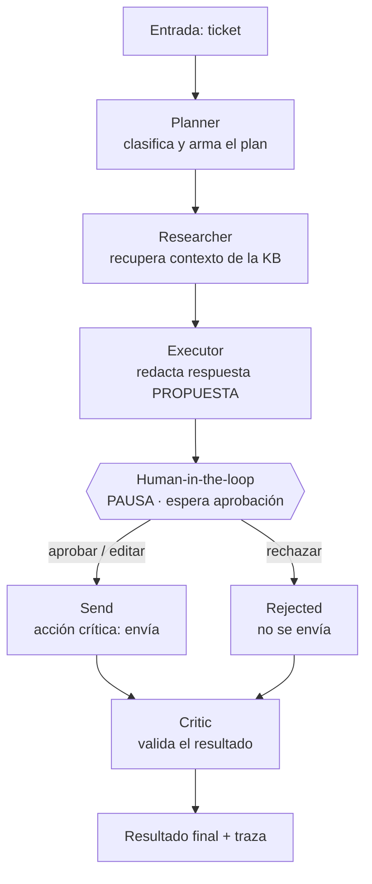

# Flujo de orquestación y roles

El sistema coordina cuatro agentes especializados mediante un grafo de estados
(LangGraph). El estado compartido (`TicketState`) es el "pizarrón" que cada
agente lee y actualiza a medida que el ticket avanza.

## Diagrama

## Roles

| Agente | Entrada que lee | Salida que escribe |
|---|---|---|
| **Planner** | `subject`, `body` | `category`, `priority`, `plan` |
| **Researcher** | `category` | `context` (artículos de la KB) |
| **Executor** | `subject`, `body`, `context` | `draft_reply` (propuesta, sin enviar) |
| **Gate HITL** | `draft_reply` | `decision`, `final_reply` (lo fija el humano) |
| **Send / Rejected** | `decision`, `final_reply` | `sent` |
| **Critic** | `final_reply`, `sent`, `priority` | `critique` |

## Por qué el gate está donde está

El `Executor` **propone** pero no ejecuta. La única acción con efecto real
—enviar la respuesta al cliente— está aislada en el nodo `Send`, que solo se
alcanza si un humano aprobó. Así, si el modelo se equivoca al redactar, el error
nunca sale al cliente sin revisión.

## Mecánica del interrupt (LangGraph)

1. El grafo se compila con `interrupt_before=["approval"]` y un checkpointer.
2. `app.invoke(estado_inicial, config)` corre hasta **antes** de `approval` y persiste el estado.
3. Se inspecciona con `app.get_state(config)` (queda `next == ("approval",)`).
4. El humano decide: `app.update_state(config, apply_decision(...))`.
5. `app.invoke(None, config)` reanuda desde el gate hasta el final.

El `thread_id` del `config` identifica la conversación, lo que permite pausar y
reanudar de forma segura incluso en procesos distintos (si el checkpointer es
persistente, p. ej. SQLite/Postgres).
